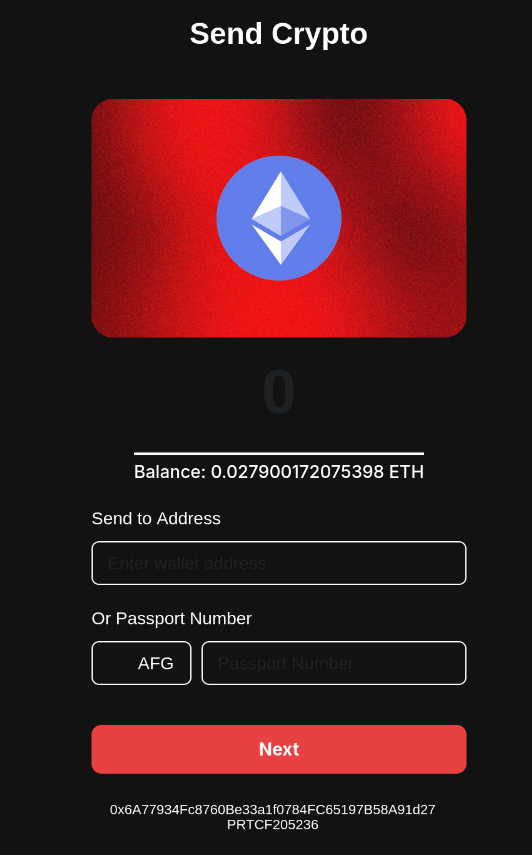

# Swiish Money

## 💡 Breaking Down Crypto Barriers

Swiish Money aims to make cryptocurrency accessible to everyone by removing traditional barriers to entry. We believe blockchain technology should be as easy to use as traditional payment apps. Here's how we're achieving this:

- **No Crypto Knowledge Required**: Users only need their passport and Self xyz app to send and receive crypto - no need to understand wallet addresses or private keys
- **Instant Setup**: Automatic wallet creation means users can start transacting within seconds
- **Simple User Experience**: Send crypto as easily as
- scanning a qr code
- **Zero Technical Barriers**: No need to understand blockchain terminology or complicated setup processes

## 🚀 Overview

Swiish Money is a web application that allows users to send eth to anyone using just their passport and Self app, similar to traditional mobile payment apps but powered by blockchain technology.

https://swiish.money

## ✨ Features

- Self xyz authentication
- Send eth using passport or wallet addresses
- Real-time gas fee estimation
- Automatic wallet creation for new users
- Mobile-first responsive design

## Screenshots

- HomePage

- Account page

- Confirm Transfer

- Transfer validation

## Notes
- Project is running on the sepolia eth test network https://sepolia.etherscan.io/